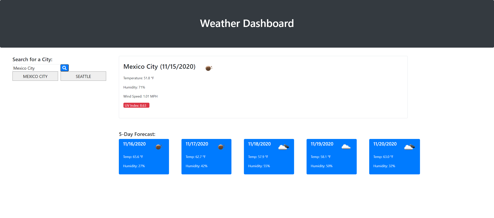

# Weather_App
# Description
Here is a weather app that gives you the daily and weekly forecast for any city that you search. This application features the the Open Weather API which stores all of the data needed to gather the most updated weather conditions for any city. Along with this, I also utulized the moments.js API to capture the current date as well as the dates for the next five days. This app will also store your most recent search, so you can come back and check the current weather whenever you need. This project demonstrates some of my skill and knowledge in applying API's, JQuery, as well as Bootstrap for styling.

# Screenshot
Here is a mock of the Weather App.

# Link
Take a look at the live version [here.](https://ianaac27.github.io/Weather_App/)
